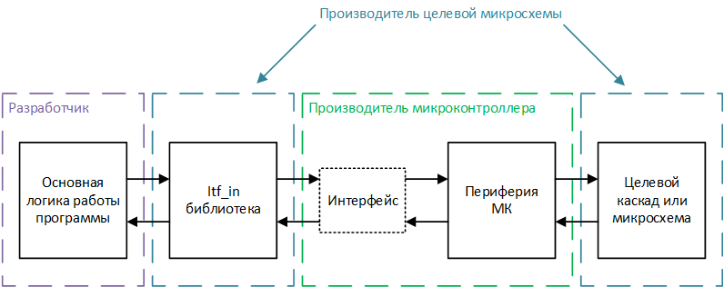

# Типы библиотек

Программирование микроконтроллеров начинается с настройки и реализации взаимодействия с периферией (например считывание показаний АЦП, передачи данных по интерфейсам связи или генерации ШИМ-сигнала). Код реализующий непосредственную настройку, а также взаимодействие с периферией мы будем называть "**программным обеспечением взаимодействия с аппаратным обеспечением**", где под аппаратным обеспечением подразумевается периферия микроконтроллеров, а под взаимодействием ее настройка и реализация обменна данными: записи в регистры и чтения из регистров.

<!-- Даже учитывая то, что типовая периферия (например GPIO, ADC, таймеры и так далее) встречается практически на любых микроконтроллеров, ее настройка и использование может отличаться. Кроме этого настройки для одного и того же микроконтроллера могут отличаться на различных печатных платах. -->

В отдельный тип программного обеспечения для встраиваемых систем можно выделить обработку данных, полученных от периферии, например, различные преобразования (показаний АЦП в определенный физический параметр) или выработку управляющих сигналов (для двигателей в зависимости от измеренного тока или скорости). Данный тип ПО мы будем называть "**зависящим от аппаратного обеспечения, но не зависящими от взаимодействия** с аппаратным обеспечением. Для объяснения названия рассмотрим пример с обработкой показаний АЦП. 

То как АЦП настраивается и как из него получаются данные (из каких регистров они считываются, в каком режиме происходит измерение, используется ли оверсемплинг и так далее) относится в *программному обеспечению взаимодействия с аппаратным обеспечением* и может отличаться для разных микроконтроллеров и схемотехники печатной платы. С другой стороны для обработки показаний, полученных с АЦП важны: разрядность получаемых от АЦП данных и период опроса, которые в свою очередь выбираются в соответствии с методикой вычисления параметра и будут оставаться одинаковыми для любых микроконтроллеров, на которых это программное обеспечение будет запускаться. Соответственно для вычисление нам **не важна реализация взаимодействия**, то есть то, как производится настройка периферии и считывание данных, но нам важно наличие конкретной периферии и конкретные значения настройки, то есть ПО данного уровня **зависит от аппаратного обеспечения**.

Кроме этого существует огромное количество ПО которое принципиально не связано с аппаратным обеспечением (то есть не использует какую-либо периферию). Пример, близкий к "железу": алгоритм вычисления положения объекта в пространстве по углам, полученным от различных датчиков (гироскоп, акселерометр, компас), не обращается к периферии и не генерирует управляющих сигналов, но при этом может быть запущен как на квадракоптере, так и на персональном компьютере для моделирования. Программное обеспечение такого типа мы будем называть "**не зависящим от аппаратного обеспечения**". 

Описанные выше типы являются условными, но по ним можно распределить практически любые элементы ПО. Для каждого описанного типа возможна реализация независимых библиотек, которые мы классифицируем в соответствии с типом программного обеспечения, к которому они относятся: библиотеки **независящими от аппаратного обеспечения (hardware independent libraries)**, библиотеки **зависящие от аппаратного обеспечения, но не зависящие от взаимодействия (hardware dependent, interfacing independent libraries) с аппаратным обеспечением - далее itf_in-библиотеки**, библиотеки **взаимодействия с аппаратным обеспечением (hardware interfacing libraries), далее itf-библиотеки**.

<!-- Перед тем, как объяснить, зачем необходим каждый тип библиотек, нужно понять ситуации, возникающие при разработке программного обеспечения для микроконтроллеров:
* внутри современных микроконтроллеров находится большое количество периферии, соответственно каждый вывод может быть отнесен к большому количеству различных периферийных устройств;
* настройка идентичных периферий может сильно отличаться как между различными производителями, так и между различными семействами микроконтроллеров одного производителя;
* после добавления микроконтроллера на печатную плату, задачи всех ножек уже известны и не будут изменяться в процессе работы устройства. -->

Тип библиотеки определяется в соответствии со следующими правилами:
* если в библиотеке есть хотя бы одна функция, реализующая настройку или взаимодействие с каким-либо видом микроконтроллеров, библиотека является **hardware interfacing (itf)** вне зависимости от объема и остального содержания;
* если в библиотеке есть хотя бы одна функция, реализующая обработку данных от конкретной периферии, но нет функций настройки и взаимодействия с периферией, библиотека является  **hardware dependent, interfacing independent (itf_in)**;
* если в библиотеке нет никаких зависимостей от периферии (будь то настройка, взаимодействие или обработка), библиотека является **hardware independent**.

<!-- При этом не смотря ни на что, максимальную унификацию и удобства обеспечивают "чистые библиотеки", по возможности не реализующие функции других типов.  НАДО ОБ ЭТОМ СКАЗАТЬ, КОГДА БУДЕТ ХОРОШАЯ ВОЗМОЖНОСТЬ-->

## Наш подход к работе с каждым типом библиотек

**Мы не беремся каким-либо образом классифицировать и стандартизировать независящие от аппаратного обеспечения библиотеки**, так как они очень распространены и могут быть применены далеко за пределами разработки программного обеспечения для встраиваемых систем.

**Нашей основной целью является продвижение идеи itf_in-библиотек и стандартизация их оформления** для обеспечения более унифицированного интерфейса взаимодействия между различными целевыми микросхемами - ИС различных видов, которые управляются микроконтроллерами, и микроконтроллерами любых производителей. Для понимания идеи itf_in-библиотек рассмотри простой пример библиотеки, для обмена данными с 3-осевым гироскопом (целевая микросхема).

Обмен данными с гироскопом происходит посредством интерфейса SPI, кроме этого для вывод микроконтроллера из режима сна необходимо подавать логическую единицу на определенную ножку микросхемы, для чего подразумевается использование цифрового выхода микроконтроллера. itf_in библиотеки строятся по следующему принципу:

Во-первых, **itf_in-библиотека может быть запущена только на микроконтроллере, имеющим необходимую периферию**, для нашего примера микроконтроллер должен либо иметь свободный аппаратный SPI-интерфейс, либо реализовывать программный. Интерфейс SPI должен быть корректно подключен к целевой микросхеме на печатной плате. Один вход-выход микроконтроллера должен быть подключен к ножке управления режимом сна целевой микросхемы.
Во-вторых, **itf_in-библиотека должна выдвигать требования к настройкам и интерфейсу взаимодействия с периферией микроконтроллера**. Для нашего примера **требования к настройкам периферии** могут представлять требования к настройке интерфейса SPI (скорости обмена данными, вида кадра, и так далее) и требования к настройке ножки микроконтроллера в режим цифрового выхода. Под **интерфейсом взаимодействия с периферией** подразумевается набор функций, которые имеют заданный заранее формат входных и выходных параметров, и выполняют определенную операцию с периферией. Для нашего примера itf_in может затребовать интерфейс взаимодействия, состоящий из трех функций:
* с одним входным параметром типа int8_t, возвращающая значение типа int8_t. Функция должна отправлять по интерфейсу SPI входной байт и возвращать полученный из интерфейса байт;
* без входных и выходных параметров. Устанавливающая на подключенной к гироскопу ножке микроконтроллера "1". Необходимость представлять даже такую элементарную операцию, как установка установка ножки в "1", в виде отдельной функции, а не макроса, обоснована и  описана далее по тексту;
* без входных и выходных параметров. Устанавливающая на подключенной к гироскопу ножке микроконтроллера "0";  
**На основании выставленный требований, itf_in-библиотека реализует задуманный функционал**. itf_in-библиотека может использует интерфейс взаимодействия с периферией для реализации любой, сколь угодно сложной логики обмена данными, например можно реализовать настройку и чтение любых регистров в памяти, а также управлять режимом работы гироскопа. itf_in библиотека использует интерфейс посредством указателей на затребованные функции и соответственно является условно кроссплатформенной, так как может быть запущена на любом микроконтроллере, удовлетворяющем требованиям библиотеки. Правила оформления и использования itf_in библиотек подробно рассматриваются в главе [interfacing independent]().

Требования по настройке и организации интерфейса взаимодействия с itf_in библиотеками могут быть реализованы непосредственно при разработке программного обеспечения (без выделения в отдельную библиотеку). Кроме этого большое количество производителей микроконтроллеров предоставляют Hardware annotation libraries (HAL) и инструменты графической настройки, которые могут быть также использованы для настройки и организации интерфейса, что может значительно сократить время на разработку. Кроме этого мы предлагаем собственный формат itf-библиотек, который подразумевает разработку библиотеки под каждое конкретное устройство (каждый микроконтроллер на конкретной печатной плате), которая бы реализовывала полный, но не избыточный набор функций, необходимый для использования любых подходящих itf_in библиотек. Мы используем данный формат для внутренней разработки программного обеспечения и не настаиваем на его повсеместном использовании. Подробности о Hople-формате оформления itf-библиотек, можно прочитать в главе [hardware interfacing]()

## Преимущества использования itf_in-библиотек

Главная идея itf_in-библиотек повсеместная унификация программного обеспечения для встраиваемых систем, которая может быть полезна всем основным сторонам разработки: производителям микроконтроллеров, производителем целевых микросхем, разработчикам программного обеспечения.

### Преимущества для производителей микроконтроллеров
Большинство крупных производителей микроконтроллеров уже сейчас в том или ином виде предоставляют библиотеки надстройки над аппаратным обеспечением (HAL) и инструменты визуальной настройки микроконтроллеров, с помощью которых становится очень просто выполнить требования любых itf_in библиотек, то есть большинство производителей микроконтроллеров уже поддерживают концепцию itf_in-библиотек. Кроме этого, стандартизация itf_in-библиотек позволит сформировать базу методов, которые должны обязательно присутствовать в HAL, что позволит при необходимости расширить уже имеющиеся библиотеки и облегчит разработку библиотек для производителей, которые таковых еще не предоставляют.

### Для производителей микросхем
Производители целевых микросхем продумывают то, как именно микроконтроллеры будут обмениваться данными с их устройствами и соответственно могут разрабатывать itf_in-библиотеки для своих ИС. Данные библиотеки могут быть как просто примерами, реализующими настройку и базовое взаимодействие с устройством, так и могут реализовывать полный набор методов для управления микросхемой. Учитывая, что itf_in-библиотеки являются условно кроссплатформенными, разработчики микросхем могут отладить их на любом подходящем микроконтроллере и быть уверенными, что они будут работать везде. Кросплатформенность значительно упростит процесс разработки программного обеспечения уже в итоговых устройствах и сделает микросхему привлекательнее в глазах разработчиков, а значит и потенциальных покупателей.

### Для разработчиков программного обеспечения
itf_in-библиотеки значительно упрощают процесс разработки, так как избавляют программистов от необходимости разрабатывать с нуля или переделывать имеющуюся библиотеку из-за отсутствия поддержки конкретного микроконтроллера. Кроме этого разработчики могут не использовать HAL, а разрабатывать свои, более гибкие и удобные под конкретные задачи интерфейсы.

Общая схема взаимодействия модулей показаны на рисунке ниже:

<!-- 
(В это описание надо со временем привести побольше примеров с кодом и пару картинок, разъясняющих ситуацию)
Сейчас еще задумался о том, что itf_in-библиотеки это именно библиотеки взаимодействия с какого-то рода конкретными устройствами (микросхемами или каскадами) и возможно есть смысл ввести еще четвертый тип библиотек, схожих по наполнению с itf_in, но необходимых для реализации логики работы какого-то конкретного устройства - что-то, что я когда-то называл device-библиотеками, но это надо смотреть на практике -->

[interfacing independent]:https://hople-technologies.github.io/Hople-C-MCU-guidelines-RU/lib_types/interfacing_independent.html
[hardware interfacing]:https://hople-technologies.github.io/Hople-C-MCU-guidelines-RU/lib_types/hardware_interfacing.html
